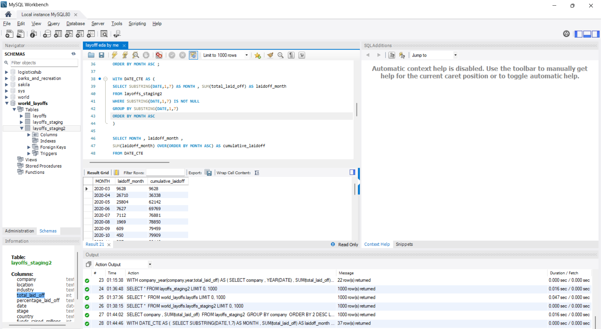
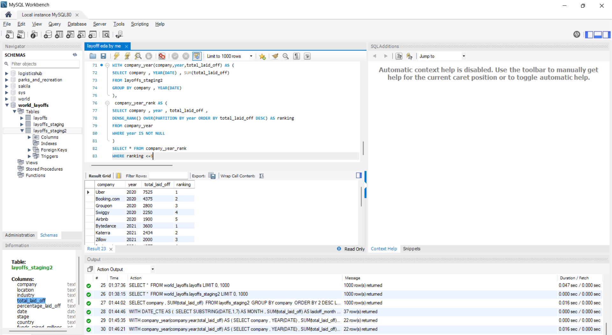
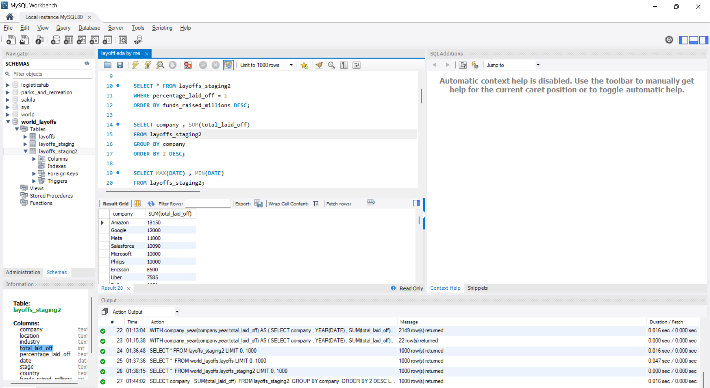

# SQL Exploratory Data Analysis — Global Layoffs Dataset

## Project Overview

This project focuses on performing Exploratory Data Analysis (EDA) on a real-world global layoffs dataset using SQL.

The objective of this analysis was to explore layoff trends across companies, industries, countries, funding stages, and time periods in order to uncover meaningful business insights and patterns.

Before analysis, the dataset was cleaned and standardized using SQL-based data cleaning techniques such as duplicate removal, null handling, data standardization, and date formatting.

This project simulates a real-world analyst workflow:

* Raw Data → Data Cleaning → Exploratory Data Analysis → Business Insights
* ## Project Workflow

Raw CSV Dataset
        ↓
Data Cleaning & Standardization
        ↓
Exploratory Data Analysis (EDA)
        ↓
Business Insights & Trend Discovery
        ↓
SQL Portfolio Project Deployment on GitHub

---

# Dataset Information

The dataset contains global layoffs data including:

* Company names
* Industry types
* Countries and locations
* Total employees laid off
* Percentage layoffs
* Funding raised
* Company stage
* Layoff dates

Dataset Source:
Layoffs Dataset from Kaggle

---

# Project Objectives

The main goals of this project were to:

* Analyze companies with the highest layoffs
* Identify industries most impacted by layoffs
* Explore layoffs trends across countries and years
* Track rolling cumulative layoffs over time
* Rank top companies by yearly layoffs
* Practice advanced SQL concepts on real-world datasets
* Develop business-oriented analytical thinking

---

# Tools & Technologies Used

* MySQL
* SQL Window Functions
* Common Table Expressions (CTEs)
* Aggregate Functions
* Date Functions
* Git & GitHub

## SQL Techniques Demonstrated

- Data Cleaning
- Aggregation & Grouping
- Time Series Analysis
- Window Functions
- Ranking Functions
- Common Table Expressions (CTEs)
- Rolling Calculations
- Business Trend Analysis
---

# Data Cleaning Process

The dataset was cleaned before performing analysis.

Cleaning tasks included:

* Removing duplicate records
* Creating staging tables
* Standardizing inconsistent values
* Handling null and blank values
* Formatting date columns
* Removing unnecessary rows and columns


# Key SQL Concepts Used

## Aggregate Functions

```sql
SUM()
MAX()
MIN()
COUNT()
AVG()
```

## Window Functions

```sql
ROW_NUMBER()
DENSE_RANK()
SUM() OVER()
```

## Date Functions

```sql
YEAR()
SUBSTRING()
STR_TO_DATE()
```

## Common Table Expressions (CTEs)

```sql
WITH cte_name AS (...)
```

---

# Analysis Performed

## Company Analysis

* Companies with the highest total layoffs
* Companies with the largest single-day layoffs
* Companies with complete (100%) layoffs

## Industry Analysis

* Industries most affected by layoffs
* Comparison of layoffs across sectors

## Country & Location Analysis

* Countries with highest layoffs
* Locations most impacted globally

## Time Series Analysis

* Yearly layoffs trends
* Monthly layoffs trends
* Rolling cumulative layoffs over time

## Ranking Analysis

* Top companies by layoffs per year using `DENSE_RANK()`

---

# Example Query — Rolling Cumulative Layoffs

```sql
WITH DATE_CTE AS (
    SELECT
        SUBSTRING(date,1,7) AS month,
        SUM(total_laid_off) AS laid_off_month
    FROM layoffs_staging2
    GROUP BY SUBSTRING(date,1,7)
)

SELECT
    month,
    laid_off_month,
    SUM(laid_off_month)
    OVER(ORDER BY month ASC) AS cumulative_layoffs
FROM DATE_CTE;
```
## Business Questions Solved

### 1. Which companies experienced the highest layoffs?
Large technology companies recorded some of the highest total layoffs across the dataset, showing the significant impact of economic uncertainty and cost-cutting measures in the tech sector.

### 2. Which industries were most affected globally?
The technology industry experienced the highest number of layoffs overall, followed by industries heavily dependent on rapid growth and external funding.

### 3. How did layoffs change over time?
Layoffs increased sharply during periods of economic slowdown and uncertainty, with noticeable spikes during specific months and years shown through rolling cumulative analysis.

### 4. Which countries had the largest workforce reductions?
The United States recorded the highest total layoffs in the dataset, reflecting the large concentration of global technology and startup companies.

### 5. Which companies had complete shutdowns (100% layoffs)?
Several startups and smaller companies experienced complete workforce reductions, indicating shutdowns, bankruptcies, or failed business operations.

### 6. How do rolling layoffs trends reflect economic slowdowns?
Rolling cumulative analysis revealed that layoffs accelerated rapidly during downturn periods, demonstrating how macroeconomic conditions directly affected workforce stability.

### 7. Which companies consistently ranked among the top layoffs each year?
Using `DENSE_RANK()` and yearly ranking analysis, several major companies repeatedly appeared among the highest yearly layoffs, indicating recurring restructuring efforts over multiple years.
---

# Key Insights Discovered

* Several startups experienced complete shutdowns with 100% layoffs.
* The technology industry recorded some of the highest layoffs globally.
* Layoffs increased significantly during economic downturn periods.
* Some heavily funded companies still experienced major layoffs or shutdowns.
* The United States had one of the highest total layoffs across the dataset.
* Rolling cumulative analysis showed rapid growth in layoffs during peak periods.

---

# Learning Outcomes

Through this project, I strengthened my understanding of:

* Real-world SQL workflows
* Data cleaning techniques
* Exploratory Data Analysis (EDA)
* Window functions and ranking analysis
* Business-focused analytical thinking
* Writing optimized and readable SQL queries
* Structuring portfolio-ready analytics projects

---
## Query Output Snapshots

### Rolling Cumulative Layoffs Analysis


### Dense Rank Company Analysis


### Top Companies by Total Layoffs


# Author

Pulkit

This project was built as part of my journey in Data Analytics and SQL portfolio development.
------
➔ Prerequisite: Read about how I engineered the staging tables and scrubbed this dataset in my [Data Cleaning Repository Link Here https://github.com/pulkitxc/sql-layoffs-data-cleaning]
